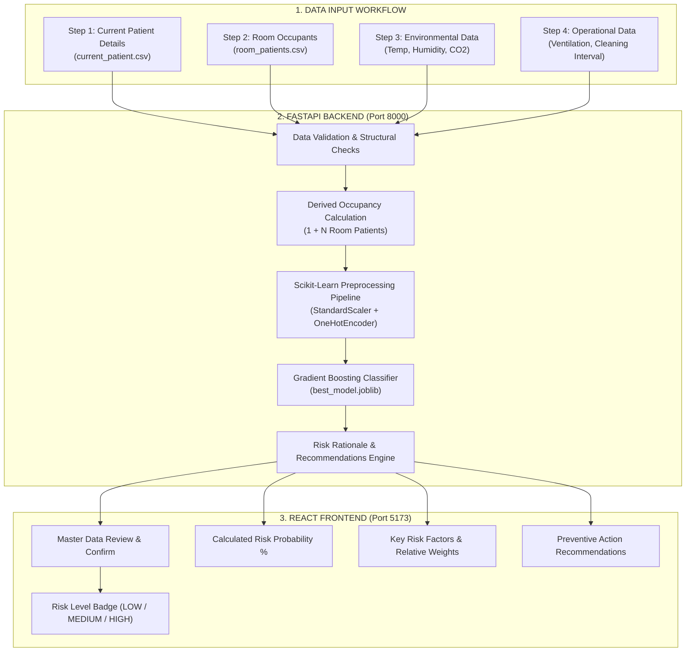

# Predictive Intelligence Framework for Early Hospital Infection Risk Assessment

An end-to-end Machine Learning and Web-based Decision Support Prototype for early estimation of hospital infection risk using clinical healthcare data, operating room environmental parameters, and hospital operational factors.

**Stage-I Prototype** | B.Tech Final-Year AIML Major Project  

---

## 🌟 Key Features

- **Multi-Source Data Architecture**: Combines patient-level clinical surgical data with operating room environmental parameters (Temperature, Humidity, CO2) and operational factors (Ventilation, Cleaning Intervals).
- **High-Accuracy ML Engine**: Trained using **Gradient Boosting Classifier** on 2,000 surgical records ($79.70\%$ Accuracy, $0.9312$ ROC-AUC score).
- **Multi-Step File Upload Workflow**: Healthcare professionals can upload `current_patient.csv` and `room_patients.csv` (CSV/JSON/XLSX) rather than manually entering every detail.
- **Derived Room Occupancy**: Calculates total room occupancy ($1 \text{ Current Patient} + N \text{ Room Occupants}$) dynamically and factors room density into the ML prediction.
- **Clinical & Environmental Risk Rationale**: Automatically generates human-readable explanations detailing *why* a specific risk level (LOW, MEDIUM, HIGH) was assigned.
- **1-Click Demo Evaluation**: Built-in ⚡ **Load Sample Demo Files** button for instant testing during project reviews.
- **Anonymized & Privacy-Compliant**: Uses synthetic patient IDs (`P001`, `P002`) and enforces strict PII removal (no names, phone numbers, or addresses stored).

---

## 📐 System Architecture



---

## 🛠️ Technology Stack

| Layer | Technologies Used |
| :--- | :--- |
| **Frontend** | React 18, Vite, TypeScript, Vanilla CSS (Inter typography) |
| **Backend API** | Python 3.9+, FastAPI, Uvicorn, Pydantic, Pandas, NumPy |
| **Machine Learning** | Scikit-Learn (Gradient Boosting, Random Forest, Logistic Regression), Joblib |
| **Data Formats** | CSV, JSON, Excel (.xlsx) |

---

## 📊 Machine Learning Model Benchmarks

| Algorithm | Accuracy | Precision | Recall | F1-Score | ROC-AUC | Status |
| :--- | :--- | :--- | :--- | :--- | :--- | :--- |
| 🏆 **Gradient Boosting** | **79.70%** | **79.60%** | **79.70%** | **0.7964** | **0.9312** | **SELECTED MODEL** |
| **Logistic Regression** | 79.40% | 79.14% | 79.40% | 0.7925 | 0.9251 | Evaluated |
| **Random Forest** | 78.70% | 78.53% | 78.70% | 0.7860 | 0.9198 | Evaluated |

---

## ⚡ Quick Start: How to Clone & Run

### Prerequisites
Make sure you have installed:
- **Python 3.9+** ([Download Python](https://www.python.org/downloads/))
- **Node.js 18+ & npm** ([Download Node.js](https://nodejs.org/))
- **Git** ([Download Git](https://git-scm.com/))

---

### Step 1: Clone the Repository

```bash
git clone https://github.com/Mummadi-shiva-ganesh/Predictive-Framework-for-Hospital-Infection-Risk-Assessment-Using-Historical-Healthcare-Data-and-ML.git
cd Predictive-Framework-for-Hospital-Infection-Risk-Assessment-Using-Historical-Healthcare-Data-and-ML
```

---

### Step 2: Set Up & Run Backend Server (FastAPI)

1. Navigate to the backend directory:
   ```bash
   cd hospital-infection-risk/backend
   ```

2. Install Python dependencies:
   ```bash
   pip install pandas numpy scikit-learn fastapi uvicorn joblib pydantic requests
   ```

3. Train the ML model (generates `best_model.joblib` and `preprocessor.joblib` in `models/`):
   ```bash
   python training/train_model.py
   ```

4. Launch the FastAPI backend server:
   ```bash
   uvicorn app.main:app --host 0.0.0.0 --port 8000 --reload
   ```

Backend server will run at: **`http://localhost:8000`**  
Interactive API Docs (Swagger): **`http://localhost:8000/docs`**

---

### Step 3: Set Up & Run Frontend Dashboard (React + Vite)

1. Open a new terminal and navigate to the frontend directory:
   ```bash
   cd hospital-infection-risk/frontend
   ```

2. Install Node modules:
   ```bash
   npm install
   ```

3. Start the Vite development server:
   ```bash
   npm run dev
   ```

Frontend app will run at: **`http://localhost:5173`**

---

## 🧪 Demonstration & Testing Guide

### Option A: 1-Click Instant Test (Recommended for Reviews)
1. Open **`http://localhost:5173`** in your browser.
2. Click the green button at the top right: **`⚡ Load Sample Demo Files (1-Click Test)`**.
3. Click **`🚀 Predict Infection Risk`** on Step 5.
4. View the color-coded Risk Output, Calculated Probability, Risk Rationale Explanation, and Preventive Recommendations.

### Option B: Manual Sample File Upload
Use the pre-formatted sample files in `sample_data/`:
- **Step 1**: Upload `sample_data/current_patient.csv`
- **Step 2**: Upload `sample_data/room_patients.csv`
- **Step 3**: Confirm/Adjust Environmental Conditions (Temp: `29 °C`, Humidity: `75%`, CO2: `1200 ppm`)
- **Step 4**: Confirm/Adjust Operational Conditions (Ventilation: `Poor`, Cleaning Interval: `18 hours`)
- **Step 5**: Review & Predict → **HIGH RISK Assessment Output**

---

## 📁 Repository Directory Structure

```
Predictive-Framework-for-Hospital-Infection-Risk-Assessment-Using-Historical-Healthcare-Data-and-ML/
│
├── docs/                               # Comprehensive Project Reports
│   ├── data_collection_report.md       # Data Sources, Methodology & Schema Design
│   ├── indian_data_sources_analysis.md # Analysis of ICMR AMRSN 2024 & HMIS Sources
│   └── implementation_plan.md         # Phased System Development Plan
│
├── sample_data/                        # Sample CSV Files for Workflow Testing
│   ├── current_patient.csv             # Sample Patient P001 Record
│   ├── room_patients.csv               # Sample Room R101 Occupants (P002, P003, P004)
│   ├── environmental_data.csv          # Sample Room Environmental Readings
│   └── operational_data.csv            # Sample Room Operational Status
│
├── hospital-infection-risk/
│   ├── backend/                        # Python FastAPI Backend & ML Model
│   │   ├── app/
│   │   │   └── main.py                 # API Endpoints, Validation & Rationale Logic
│   │   ├── data/
│   │   │   └── dataset.csv             # Training Dataset (2,000 Surgical Records)
│   │   ├── models/
│   │   │   ├── best_model.joblib       # Saved Gradient Boosting Model Artifact
│   │   │   └── preprocessor.joblib     # Saved Feature Scaling & Encoding Pipeline
│   │   └── training/
│   │       └── train_model.py          # ML Training & Evaluation Script
│   │
│   └── frontend/                       # React + Vite + TypeScript Frontend
│       ├── src/
│       │   ├── components/             # Step-by-Step Workflow & Results Cards
│       │   ├── pages/Dashboard.tsx     # Master Controller Component
│       │   ├── services/api.ts         # REST API Client
│       │   └── utils/fileParser.ts     # Client-Side CSV & JSON Parser
│       ├── index.html
│       ├── package.json
│       └── vite.config.ts
│
└── README.md                           # Project Documentation
```

---

## 📄 Research Documentation

For detailed insights into data collection methodology, Indian health datasets (ICMR AMRSN 2024, HMIS), and dataset schema preparation:
- [Data Collection Report](docs/data_collection_report.md)
- [Indian Data Sources Analysis](docs/indian_data_sources_analysis.md)

---

## 📌 Disclaimer
This software is built as an academic research prototype for Stage-I final-year B.Tech project review. Environmental and operational variables are simulated for proof-of-concept modeling. This system is designed as a decision-support tool and does not replace professional clinical judgment.
