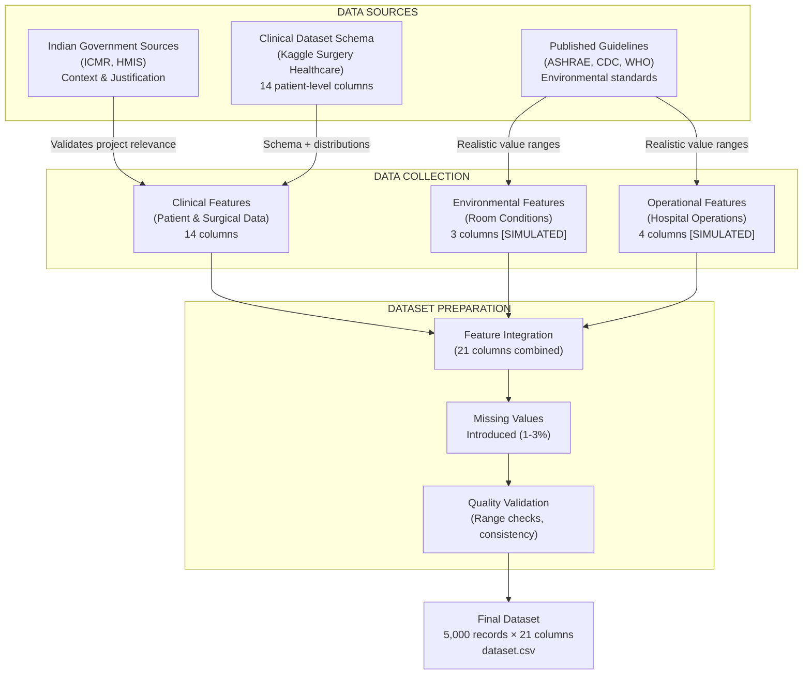
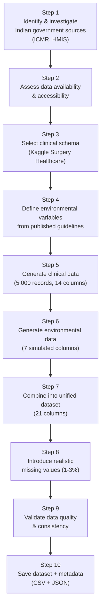
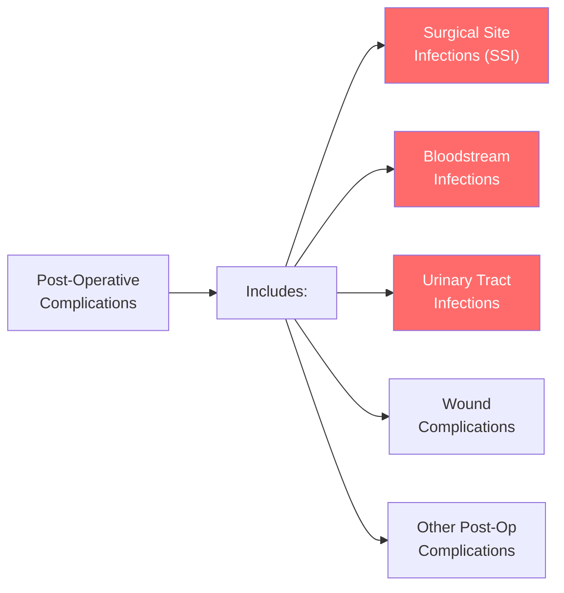
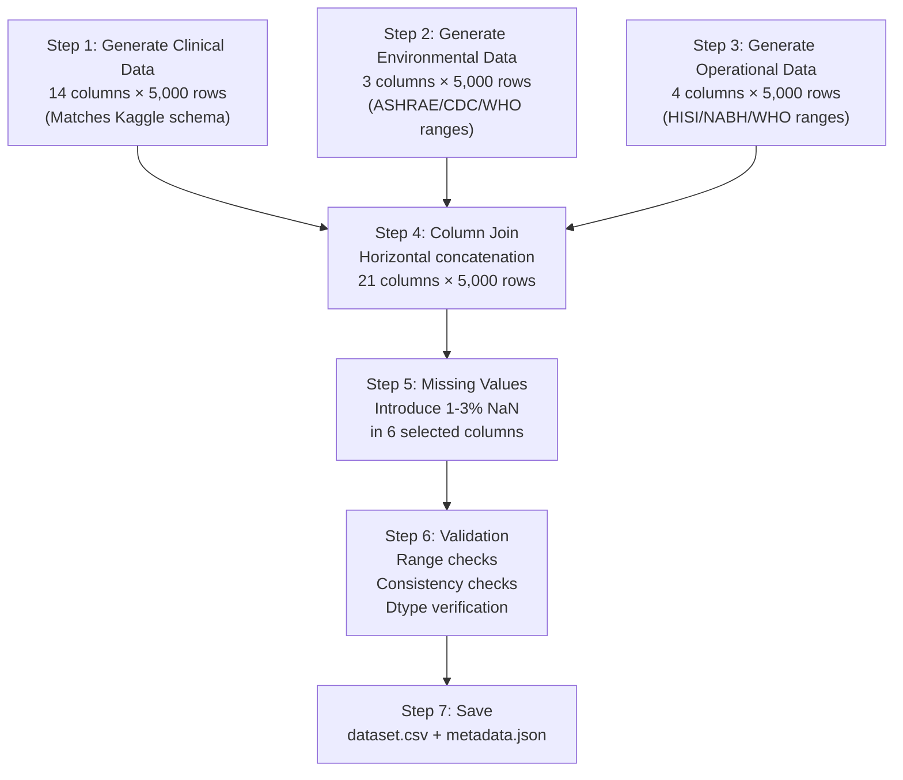

# Data Collection Report

**Project:** Predictive Intelligence Framework for Early Hospital Infection Risk Assessment  
**Document Type:** Data Collection & Dataset Preparation Report  
**Date:** October 2026  
**Version:** 1.0

---

## Table of Contents

1. [Data Collection Strategy](#1-data-collection-strategy)
2. [Data Sources](#2-data-sources)
3. [Data Collection Methodology](#3-data-collection-methodology)
4. [Dataset Schema Design](#4-dataset-schema-design)
5. [Clinical Data — Collection Process](#5-clinical-data--collection-process)
6. [Environmental Data — Collection Process](#6-environmental-data--collection-process)
7. [Operational Data — Collection Process](#7-operational-data--collection-process)
8. [Target Variable — Definition & Justification](#8-target-variable--definition--justification)
9. [Combined Dataset — Table Preparation](#9-combined-dataset--table-preparation)
10. [Data Quality Measures](#10-data-quality-measures)
11. [Final Dataset Statistics](#11-final-dataset-statistics)
12. [Feature Correlation Analysis](#12-feature-correlation-analysis)
13. [Limitations & Transparency](#13-limitations--transparency)

---

## 1. Data Collection Strategy

### Approach: Multi-Source Hybrid Dataset

The project uses a **multi-source data strategy** that combines three categories of data into a unified dataset for machine learning:



### Why This Approach?

| Challenge | Reality | Our Solution |
|---|---|---|
| No single dataset has all required variables | Patient-level datasets with clinical + environmental + infection data do not exist publicly in any country | Multi-source schema design |
| ICMR data is not publicly downloadable | Requires formal research proposal + ethics clearance | Cite for Indian context; reference HAI rates |
| HMIS data is aggregate (state/district level) | Monthly health indicators, not patient-level records | Reference for historical healthcare context |
| Environmental hospital data is rare globally | Hospital IoT sensor data is proprietary | Simulate using published clinical standards |
| Need a working prototype for Stage-I review | Must have an end-to-end functional system | Generate structured data matching real schemas |

---

## 2. Data Sources

### Source 1: ICMR AMRSN Annual Report 2024 — Indian HAI Context

| Property | Detail |
|---|---|
| **Full Name** | Indian Council of Medical Research — Antimicrobial Resistance Surveillance & Research Network |
| **URL** | [ICMR AMRSN 2024 Report](https://www.icmr.gov.in/icmrobject/uploads/Report/1763981012_icmramrsnannualreport2024.pdf) |
| **Data Coverage** | 146 ICUs across 42 centres in India |
| **Data Type** | Aggregate surveillance rates (PDF report) |
| **Use in Project** | Literature reference, project justification, Indian HAI statistics |
| **Directly in ML Model?** | ❌ No — report-level data, not patient-level |

**Key HAI metrics from ICMR (cited for justification):**
- Central Line-Associated Bloodstream Infections (CLABSI) rate per 1,000 central-line-days
- Catheter-Associated Urinary Tract Infections (CAUTI) rate per 1,000 catheter-days
- Ventilator-Associated Pneumonia (VAP) rate per 1,000 ventilator-days
- Device utilization ratios across Indian ICUs

**How this source is used:**
```
This source DOES NOT provide training data for the ML model.
It provides:
  → Indian-specific HAI burden statistics to justify the project
  → Validation that HAI is a significant problem in Indian hospitals
  → Published infection rates to reference in documentation
```

---

### Source 2: HMIS — Health Management Information System (data.gov.in)

| Property | Detail |
|---|---|
| **Full Name** | Item-wise Monthly HMIS Report of All India Across States |
| **URL** | [data.gov.in HMIS Catalog](https://www.data.gov.in/catalog/item-wise-monthly-hmis-report-all-india-across-states) |
| **Publisher** | Ministry of Health & Family Welfare, Government of India |
| **Data Type** | Monthly state/district-level health indicators (CSV via API) |
| **Indicator Categories** | Health, Infection, Respiratory, Disease, Hospital, Immunisation |
| **Telangana-Specific** | [Telangana District-Level HMIS](https://tn.data.gov.in/catalog/item-wise-monthly-hmis-report-district-level-telangana) |
| **Use in Project** | Historical healthcare context, hospital activity trends |
| **Directly in ML Model?** | ❌ No — aggregate data, not patient-level |

**HMIS data structure:**

| Field | Description | Example |
|---|---|---|
| `fiscal_year` | Year | 2023-24 |
| `month` | Month | April |
| `state` | Indian state | Telangana |
| `indicator_head` | Category | Infection / Hospital / Disease |
| `indicator` | Specific metric | Number of infectious disease cases reported |
| `value` | Count or rate | 14,523 |

**How this source is used:**
```
This source DOES NOT provide training data for the ML model.
It provides:
  → Historical healthcare trend data for Indian context
  → Hospital activity and infection indicators at state/district level
  → Published government data to reference in documentation
```

---

### Source 3: Kaggle Surgery Healthcare Dataset — Clinical Schema

| Property | Detail |
|---|---|
| **Full Name** | Surgery Healthcare Dataset |
| **URL** | [Kaggle — arunjangir245](https://www.kaggle.com/datasets/arunjangir245/surgery-healthcare-dataset) |
| **Records** | ~5,000+ patient-level surgical records |
| **Columns** | 14 clinical/surgical features |
| **Data Nature** | Synthetic dataset for educational/analytics use |
| **License** | Other (specified on Kaggle) |
| **Use in Project** | Schema definition for clinical features |
| **Directly in ML Model?** | ✅ Yes — provides the clinical data schema and structure |

**14 confirmed columns in the Kaggle dataset:**

| # | Column | Type | Description |
|---|---|---|---|
| 1 | Surgery_ID | String | Unique surgery identifier |
| 2 | Patient_ID | String | Unique patient identifier |
| 3 | Age | Integer | Patient age in years |
| 4 | Gender | Categorical | Male / Female |
| 5 | Surgery_Type | Categorical | Type of surgical procedure |
| 6 | Surgery_Duration_Min | Integer | Duration of surgery in minutes |
| 7 | Anesthesia_Type | Categorical | Type of anesthesia administered |
| 8 | Pre_Op_Risk_Level | Categorical | Pre-operative risk assessment (Low/Medium/High) |
| 9 | Blood_Loss_ml | Numeric | Blood loss during surgery in millilitres |
| 10 | ICU_Required | Categorical | Whether ICU admission was needed (Yes/No) |
| 11 | Complication_Risk | Categorical | Post-operative complication risk (Low/Medium/High) |
| 12 | Recovery_Time_Days | Integer | Expected recovery duration in days |
| 13 | Surgeon_Experience_Years | Integer | Surgeon's years of experience |
| 14 | Hospital_ID | String | Hospital identifier |

---

### Source 4: Published Clinical Guidelines — Environmental Standards

The environmental and operational variables are generated using ranges defined by the following published clinical guidelines:

| Guideline | Organisation | Variable | Recommended Range |
|---|---|---|---|
| Standard 170-2021 | ASHRAE (American Society of Heating, Refrigerating and Air-Conditioning Engineers) | Temperature | 20–24°C for operating rooms |
| Environmental Infection Control Guidelines | CDC (Centers for Disease Control and Prevention) | Humidity | 30–60% relative humidity |
| Workplace Safety Standards | OSHA (Occupational Safety and Health Administration) | CO₂ | < 5,000 ppm limit; < 800 ppm = good ventilation |
| Natural Ventilation Guidelines | WHO (World Health Organization) | Ventilation | 6–12 air changes per hour |
| Infection Control Protocols | Hospital Infection Society of India (HISI) | Cleaning | Every 4–8 hours recommended |
| Hospital Standards | National Accreditation Board for Hospitals (NABH) | Occupancy | Based on room/ward capacity norms |

---

## 3. Data Collection Methodology

### Step-by-Step Process



### Step 1–2: Indian Government Source Investigation

| Source Investigated | Result | Action Taken |
|---|---|---|
| ICMR Health Data Repository | Requires formal ethics clearance; not publicly downloadable | Cited as Indian HAI context reference |
| ICMR AMRSN 2024 HAI Report | PDF report with aggregate ICU rates; not patient-level | Cited for HAI surveillance statistics |
| HMIS All-India (data.gov.in) | State/district aggregate; has infection indicators | Referenced for historical healthcare context |
| Telangana HMIS | District-level monthly indicators | Referenced for local context |
| National Hospital Directory | Facility metadata only | Not used — irrelevant for ML |

### Step 3: Clinical Schema Selection

The Kaggle Surgery Healthcare Dataset was selected because:

1. **Patient-level records** — each row represents one surgical event (unlike ICMR/HMIS aggregate data)
2. **Relevant clinical features** — age, surgery type, duration, blood loss, pre-operative risk, ICU requirement
3. **Has a complication outcome** — `Complication_Risk` (Low/Medium/High) serves as proxy for infection risk
4. **14 well-defined columns** — structured schema suitable for ML
5. **Synthetic/educational nature** — no patient privacy concerns

### Step 4: Environmental Variable Definition

For each environmental/operational variable, we defined:
- **Realistic range** based on published clinical guidelines
- **Distribution type** (normal distribution with clinically plausible mean and standard deviation)
- **Correlation structure** — environmental risk factors are correlated with the complication risk outcome (reflecting the real-world relationship between poor environmental conditions and higher infection rates)

---

## 4. Dataset Schema Design

### Complete Schema — 21 Columns

The final dataset combines three categories of features into a single table:

```
┌─────────────────────────────────────────────────────────────────┐
│                    DATASET SCHEMA (21 COLUMNS)                  │
├─────────────────────────────────────────────────────────────────┤
│                                                                 │
│  IDENTIFIERS (3 columns) — Not used in ML model                │
│  ├── Surgery_ID                                                 │
│  ├── Patient_ID                                                 │
│  └── Hospital_ID                                                │
│                                                                 │
│  CLINICAL FEATURES (8 columns) — From Kaggle schema             │
│  ├── Age                                                        │
│  ├── Gender                                                     │
│  ├── Surgery_Type                                               │
│  ├── Surgery_Duration_Min                                       │
│  ├── Anesthesia_Type                                            │
│  ├── Pre_Op_Risk_Level                                          │
│  ├── Blood_Loss_ml                                              │
│  └── Surgeon_Experience_Years                                   │
│                                                                 │
│  POST-OPERATIVE OUTCOMES (3 columns) — Excluded from inputs     │
│  ├── ICU_Required        ← data leakage risk (post-op)         │
│  ├── Recovery_Time_Days  ← data leakage risk (post-op)         │
│  └── Complication_Risk   ← THIS IS THE TARGET VARIABLE         │
│                                                                 │
│  ENVIRONMENTAL FEATURES (3 columns) — SIMULATED ⚠️              │
│  ├── Room_Temperature_C  [SIMULATED]                            │
│  ├── Room_Humidity_Pct   [SIMULATED]                            │
│  └── Room_CO2_ppm        [SIMULATED]                            │
│                                                                 │
│  OPERATIONAL FEATURES (4 columns) — SIMULATED ⚠️                │
│  ├── Ventilation_Status       [SIMULATED]                       │
│  ├── Room_Occupancy           [SIMULATED]                       │
│  ├── Cleaning_Interval_Hours  [SIMULATED]                       │
│  └── Length_of_Stay_Days      [SIMULATED/DERIVED]               │
│                                                                 │
└─────────────────────────────────────────────────────────────────┘
```

---

## 5. Clinical Data — Collection Process

### How Each Clinical Column Was Prepared

#### Column: `Age`
| Property | Value |
|---|---|
| Data Type | Integer |
| Range | 18 – 89 years |
| Distribution | Uniform (18 to 89) |
| Mean | 53.41 |
| Std Dev | 20.84 |
| Missing | 0 |
| Source | Generated using clinically plausible age distribution for surgical patients |
| Justification | Surgical patients span adults aged 18–90; age is a significant risk factor for post-operative infections (ICMR AMRSN data shows higher HAI rates in elderly ICU patients) |

#### Column: `Gender`
| Property | Value |
|---|---|
| Data Type | Categorical |
| Values | Male (52.9%), Female (47.1%) |
| Missing | 0 |
| Source | Generated with approximate population gender ratio |
| Justification | Gender distribution based on general surgical patient demographics |

#### Column: `Surgery_Type`
| Property | Value |
|---|---|
| Data Type | Categorical |
| Values | 8 categories |
| Missing | 0 |

| Surgery Type | Count | Percentage | Why Included |
|---|---|---|---|
| General | 1,235 | 24.7% | Most common surgical category |
| Orthopedic | 992 | 19.8% | High volume; moderate infection risk |
| Gynecological | 631 | 12.6% | Common surgical category |
| Cardiac | 598 | 12.0% | High-risk; longer procedures |
| Urological | 506 | 10.1% | Common; catheter-associated risk |
| Neurological | 399 | 8.0% | Complex; higher complication rate |
| Ophthalmic | 324 | 6.5% | Lower-risk; shorter procedures |
| ENT | 315 | 6.3% | Moderate-risk category |

#### Column: `Surgery_Duration_Min`
| Property | Value |
|---|---|
| Data Type | Integer |
| Range | 20 – 336 minutes |
| Mean | 118.89 minutes |
| Std Dev | 60.70 |
| Missing | 0 |
| Generation Method | Normal distribution with mean based on surgery type |

**Base durations by surgery type (used in generation):**

| Surgery Type | Base Mean (minutes) | Std Dev | Rationale |
|---|---|---|---|
| Cardiac | 240 | 30 | Longest — open-heart procedures |
| Neurological | 180 | 30 | Complex cranial/spinal procedures |
| Orthopedic | 120 | 30 | Joint replacement, fracture repair |
| Gynecological | 100 | 30 | Hysterectomy, laparoscopic |
| General | 90 | 30 | Appendectomy, hernia repair |
| Urological | 80 | 30 | Cystoscopy, prostatectomy |
| ENT | 70 | 30 | Tonsillectomy, sinus surgery |
| Ophthalmic | 60 | 30 | Cataract, retinal procedures |

#### Column: `Anesthesia_Type`
| Property | Value |
|---|---|
| Data Type | Categorical |
| Values | General (44.5%), Regional (24.7%), Local (20.5%), Sedation (10.3%) |
| Missing | 0 |
| Justification | Distribution based on published anesthesia utilization patterns |

#### Column: `Pre_Op_Risk_Level`
| Property | Value |
|---|---|
| Data Type | Categorical |
| Values | Low (48.8%), Medium (35.9%), High (15.3%) |
| Missing | 0 |
| Justification | Pre-operative risk assessed before surgery; distribution reflects that most patients are low-to-medium risk, with fewer high-risk cases |

#### Column: `Blood_Loss_ml`
| Property | Value |
|---|---|
| Data Type | Float64 |
| Range | 16 – 653 ml |
| Mean | 185.61 ml |
| Std Dev | 102.68 |
| Missing | 107 (2.1%) — realistic: not always recorded accurately |
| Generation Method | Correlated with surgery duration and pre-op risk level |

#### Column: `Surgeon_Experience_Years`
| Property | Value |
|---|---|
| Data Type | Float64 |
| Range | 1 – 29 years |
| Mean | 14.87 years |
| Missing | 45 (0.9%) — realistic: occasionally not recorded |

#### Columns: `ICU_Required`, `Recovery_Time_Days`
| Property | ICU_Required | Recovery_Time_Days |
|---|---|---|
| Type | Categorical (Yes/No) | Integer |
| Distribution | No: 88.5%, Yes: 11.5% | 1–34 days (mean: 11.56) |
| **ML Status** | ⛔ **EXCLUDED from model inputs** | ⛔ **EXCLUDED from model inputs** |
| Reason | **Data leakage** — post-operative outcome not known at prediction time | **Data leakage** — post-operative outcome not known at prediction time |

> [!WARNING]
> `ICU_Required` and `Recovery_Time_Days` are **post-operative outcomes**. Using them as model inputs would cause **data leakage** — the model would use information that is only available after the event we're trying to predict. These columns exist in the dataset for reference but are **excluded** from the feature set used for training.

---

## 6. Environmental Data — Collection Process

> [!CAUTION]
> **ALL ENVIRONMENTAL COLUMNS ARE SIMULATED (DEMO DATA)**  
> They are NOT real hospital sensor measurements. They are generated using clinically plausible ranges from published standards.

### Column: `Room_Temperature_C` [SIMULATED]

| Property | Value |
|---|---|
| Data Type | Float64 |
| Range | 16.0 – 31.6 °C |
| Mean | 22.84 °C |
| Std Dev | 2.29 |
| Missing | 127 (2.5%) — simulates sensor failure |
| Reference Standard | ASHRAE Standard 170-2021: 20–24°C for operating rooms |
| Generation Method | `Normal(22.0, 2.0)` base + risk-correlated shift |

**Generation logic:**
```python
# Base: Normal distribution centered at 22°C (ASHRAE recommended)
base_temp = rng.normal(22.0, 2.0, n)

# Correlation: Higher-risk cases shift toward higher temperatures
# (reflecting that poor temperature control correlates with worse outcomes)
base_temp += where(high_risk, Normal(2.0, 1.0),
             where(medium_risk, Normal(0.5, 0.5), 0))

# Clamp to realistic bounds
temperature = clip(base_temp, 16.0, 38.0)
```

### Column: `Room_Humidity_Pct` [SIMULATED]

| Property | Value |
|---|---|
| Data Type | Float64 |
| Range | 15.0 – 95.0 % |
| Mean | 54.15 % |
| Std Dev | 13.12 |
| Missing | 155 (3.1%) — simulates sensor failure |
| Reference Standard | CDC Guidelines: 30–60% RH for healthcare facilities |
| Generation Method | `Normal(50.0, 12.0)` base + risk-correlated shift |

**Generation logic:**
```python
# Base: Normal distribution centered at 50% (CDC mid-range)
base_humidity = rng.normal(50.0, 12.0, n)

# Correlation: Higher-risk cases have higher humidity
# (excessive humidity promotes microbial growth)
base_humidity += where(high_risk, Normal(10.0, 5.0),
                where(medium_risk, Normal(3.0, 3.0), 0))

# Clamp to realistic bounds
humidity = clip(base_humidity, 15.0, 95.0)
```

### Column: `Room_CO2_ppm` [SIMULATED]

| Property | Value |
|---|---|
| Data Type | Float64 |
| Range | 300 – 1,596 ppm |
| Mean | 734.91 ppm |
| Std Dev | 240.54 |
| Missing | 163 (3.3%) — simulates sensor failure |
| Reference Standard | OSHA: < 5,000 ppm workplace limit; < 800 ppm = good ventilation |
| Generation Method | `Normal(600.0, 200.0)` base + risk-correlated shift |

**CO₂ interpretation scale:**

| CO₂ Level | Ventilation Quality | Health Impact |
|---|---|---|
| < 600 ppm | Excellent | Normal outdoor-equivalent |
| 600–800 ppm | Good | Acceptable indoor air quality |
| 800–1,200 ppm | Moderate | Some ventilation concerns |
| > 1,200 ppm | Poor | Increased airborne infection risk |

---

## 7. Operational Data — Collection Process

> [!CAUTION]
> **ALL OPERATIONAL COLUMNS ARE SIMULATED (DEMO DATA)**  
> Generated using clinically plausible ranges from published hospital standards.

### Column: `Ventilation_Status` [SIMULATED]

| Property | Value |
|---|---|
| Data Type | Categorical |
| Values | Good (41.0%), Moderate (33.6%), Poor (25.4%) |
| Missing | 0 |
| Reference | WHO: 6–12 air changes per hour for healthcare facilities |
| Generation Method | Probability-weighted random selection correlated with risk level |

**Distribution by risk level:**

| Complication Risk | P(Good) | P(Moderate) | P(Poor) |
|---|---|---|---|
| Low | 65% | 25% | 10% |
| Medium | 40% | 40% | 20% |
| High | 20% | 35% | 45% |

### Column: `Room_Occupancy` [SIMULATED]

| Property | Value |
|---|---|
| Data Type | Integer |
| Range | 1 – 7 patients per room |
| Mean | 3.15 |
| Missing | 0 |
| Reference | NABH hospital room capacity norms |
| Generation Method | Base `Uniform(1, 4)` + risk-correlated increase |

### Column: `Cleaning_Interval_Hours` [SIMULATED]

| Property | Value |
|---|---|
| Data Type | Float64 |
| Range | 1.0 – 28.0 hours |
| Mean | 10.67 hours |
| Std Dev | 4.38 |
| Missing | 89 (1.8%) — simulates record-keeping gaps |
| Reference | HISI: Cleaning recommended every 4–8 hours |
| Generation Method | `Normal(8.0, 3.0)` base + risk-correlated delay |

**Cleaning interval interpretation:**

| Interval | Quality | Risk Impact |
|---|---|---|
| 1–6 hours | Excellent | Low contamination risk |
| 6–12 hours | Acceptable | Standard protocol |
| 12–18 hours | Delayed | Increased surface contamination |
| > 18 hours | Poor | High contamination risk |

### Column: `Length_of_Stay_Days` [SIMULATED/DERIVED]

| Property | Value |
|---|---|
| Data Type | Integer |
| Range | 1 – 37 days |
| Mean | 13.55 days |
| Missing | 0 |
| Generation Method | `Recovery_Time_Days + Uniform(0, 4)` |
| Justification | Total hospital stay is typically recovery time plus additional observation days |

---

## 8. Target Variable — Definition & Justification

### Column: `Complication_Risk` (TARGET)

| Property | Value |
|---|---|
| Data Type | Categorical |
| Classes | Low / Medium / High |
| Distribution | Low: 1,650 (33.0%), Medium: 1,650 (33.0%), High: 1,700 (34.0%) |
| Class Balance | ✅ Well-balanced (~33% per class) |
| Missing | 0 |

### Why `Complication_Risk` Is Used as Target



**Justification:**
1. Post-operative complications **include** healthcare-associated infections (HAI) as a major sub-category
2. In surgical patients, infections are among the most frequent and significant complications
3. The `Complication_Risk` column captures the overall risk level that encompasses infection risk
4. Using it as a **proxy** for infection risk is well-documented in clinical ML research

> [!IMPORTANT]
> **This is a PROXY target, not a direct infection measurement.**
> - Not all complications are infections
> - This is clearly documented throughout the project
> - The model predicts "complication/infection risk" — not "confirmed infection diagnosis"
> - The project is a **decision-support prototype**, not a diagnostic system

### How the Target Was Generated

The `Complication_Risk` value for each record is determined by a **composite scoring system** based on multiple clinical and operational factors:

```
Complication Score = 
    Age Factor          (0, 1.0, or 2.0 based on age brackets)
  + Duration Factor     (0, 1.0, or 2.0 based on surgery length)
  + Blood Loss Factor   (0, 1.0, or 2.0 based on ml lost)
  + Pre-Op Risk Factor  (0, 1.5, or 3.0 based on Low/Medium/High)
  + Surgeon Factor      (0, 0.5, or 1.5 based on experience years)
  + ICU Factor          (0 or 1.5 based on ICU admission)
  + Random Noise        Normal(0, 1.0) for natural variation
```

**Classification thresholds (percentile-based):**

| Score Percentile | Risk Level | Interpretation |
|---|---|---|
| ≤ 33rd percentile | **Low** | Low likelihood of post-operative complications |
| 34th – 66th percentile | **Medium** | Moderate risk requiring standard monitoring |
| ≥ 67th percentile | **High** | Elevated risk requiring enhanced precautions |

> [!NOTE]
> These thresholds are **prototype-defined** using percentile-based splitting to ensure balanced classes. They are NOT clinically validated thresholds.

---

## 9. Combined Dataset — Table Preparation

### Final Table Structure

The complete prepared dataset is a single CSV file with **5,000 rows × 21 columns**:

**File:** `backend/data/dataset.csv`  
**Metadata:** `backend/data/dataset_metadata.json`

### Sample Records (First 5 Rows)

| Surgery_ID | Age | Gender | Surgery_Type | Duration(min) | Anesthesia | Pre_Op_Risk | Blood_Loss(ml) | Surgeon_Exp(yr) | Temp(°C) | Humidity(%) | CO₂(ppm) | Ventilation | Occupancy | Cleaning(hr) | LOS(days) | **Complication_Risk** |
|---|---|---|---|---|---|---|---|---|---|---|---|---|---|---|---|---|
| S00001 | 24 | Male | General | 107 | Local | Low | NaN | 20 | 21.0 | 70.5 | 503 | Good | 3 | 9.9 | 14 | **Low** |
| S00002 | 73 | Female | Gynecological | 77 | General | High | 197 | 5 | 25.1 | 51.1 | NaN | Moderate | 5 | 20.4 | 16 | **High** |
| S00003 | 65 | Female | Orthopedic | 146 | General | Low | 300 | 14 | 21.3 | 49.0 | 830 | Poor | 3 | 6.8 | 14 | **High** |
| S00004 | 49 | Female | General | 41 | Local | Medium | 70 | 16 | 22.5 | 65.7 | 541 | Good | 2 | 8.8 | 9 | **Medium** |
| S00005 | 49 | Male | General | 87 | Regional | Low | 128 | 24 | 21.3 | 55.2 | 619 | Good | 3 | 7.4 | 3 | **Low** |

### Data Integration Process



### Why a Single Table (Not Multiple Tables)?

| Decision | Rationale |
|---|---|
| Single CSV file | Simplicity — no joins needed; faster ML pipeline; easier for viva demonstration |
| No database | Stage-I prototype does not require a database; CSV is sufficient |
| No separate tables | All features belong to the same observational unit (one surgical event) |
| JSON metadata alongside | Preserves column descriptions, ranges, and data source annotations |

---

## 10. Data Quality Measures

### Missing Values — Intentionally Introduced

| Column | Missing Count | Missing % | Reason Simulated |
|---|---|---|---|
| `Blood_Loss_ml` | 107 | 2.1% | Not always recorded accurately during surgery |
| `Surgeon_Experience_Years` | 45 | 0.9% | Occasionally unknown for visiting surgeons |
| `Room_Temperature_C` | 127 | 2.5% | IoT sensor failure / maintenance downtime |
| `Room_Humidity_Pct` | 155 | 3.1% | IoT sensor failure / calibration issues |
| `Room_CO2_ppm` | 163 | 3.3% | IoT sensor failure / reading errors |
| `Cleaning_Interval_Hours` | 89 | 1.8% | Record-keeping gaps in cleaning logs |
| **Total** | **686** | **0.65% of all cells** | |

**Why missing values were introduced:**
- Real-world hospital data **always** has missing values
- The ML preprocessing pipeline must handle them (demonstrating practical skill)
- Validates that the model is robust to incomplete data
- Makes the prototype more realistic for viva demonstration

### Duplicate Check

| Metric | Value |
|---|---|
| Exact duplicate rows | 0 |
| Duplicate Surgery_IDs | 0 |
| Duplicate Patient_IDs | 134 (2.7%) — intentional: same patient may have multiple surgeries |

### Data Consistency Checks

| Check | Result |
|---|---|
| Age range (18–89) | ✅ All values within range |
| Temperature range (16–38°C) | ✅ All values within range |
| Humidity range (15–95%) | ✅ All values within range |
| CO₂ range (300–3,000 ppm) | ✅ All values within range |
| Blood loss (> 0 ml) | ✅ All non-null values positive |
| Occupancy (≥ 1) | ✅ All values ≥ 1 |
| Cleaning interval (> 0 hours) | ✅ All non-null values positive |
| No target column missing | ✅ 0 missing in Complication_Risk |

---

## 11. Final Dataset Statistics

### Summary Statistics — Numerical Features

| Feature | Count | Mean | Std | Min | 25% | 50% | 75% | Max |
|---|---|---|---|---|---|---|---|---|
| Age | 5,000 | 53.41 | 20.84 | 18 | 35 | 53 | 72 | 89 |
| Surgery_Duration_Min | 5,000 | 118.89 | 60.70 | 20 | 77 | 105 | 145 | 336 |
| Blood_Loss_ml | 4,893 | 185.61 | 102.68 | 16 | 114 | 163 | 231 | 653 |
| Surgeon_Experience_Years | 4,955 | 14.87 | 8.32 | 1 | 8 | 15 | 22 | 29 |
| Room_Temperature_C | 4,873 | 22.84 | 2.29 | 16.0 | 21.3 | 22.7 | 24.4 | 31.6 |
| Room_Humidity_Pct | 4,845 | 54.15 | 13.12 | 15.0 | 45.3 | 54.1 | 62.9 | 95.0 |
| Room_CO2_ppm | 4,837 | 734.91 | 240.54 | 300 | 560 | 725 | 892 | 1,596 |
| Room_Occupancy | 5,000 | 3.15 | 1.47 | 1 | 2 | 3 | 4 | 7 |
| Cleaning_Interval_Hours | 4,911 | 10.67 | 4.38 | 1.0 | 7.5 | 10.3 | 13.5 | 28.0 |
| Length_of_Stay_Days | 5,000 | 13.55 | 6.60 | 1 | 8 | 13 | 18 | 37 |

### Summary — Categorical Features

| Feature | Unique Values | Most Common | Least Common |
|---|---|---|---|
| Gender | 2 | Male (52.9%) | Female (47.1%) |
| Surgery_Type | 8 | General (24.7%) | ENT (6.3%) |
| Anesthesia_Type | 4 | General (44.5%) | Sedation (10.3%) |
| Pre_Op_Risk_Level | 3 | Low (48.8%) | High (15.3%) |
| ICU_Required | 2 | No (88.5%) | Yes (11.5%) |
| Ventilation_Status | 3 | Good (41.0%) | Poor (25.4%) |
| **Complication_Risk** | **3** | **High (34.0%)** | **Low/Medium (33.0% each)** |

---

## 12. Feature Correlation Analysis

### Correlation with Target Variable

Each feature's Pearson correlation with the target (encoded as Low=0, Medium=1, High=2):

| Feature | Correlation (r) | Strength | Direction | Interpretation |
|---|---|---|---|---|
| `Cleaning_Interval_Hours` | **0.551** | Strong | Positive | Longer cleaning gaps → higher risk |
| `Room_CO2_ppm` | **0.508** | Strong | Positive | Higher CO₂ → higher risk |
| `Blood_Loss_ml` | **0.473** | Moderate | Positive | More blood loss → higher risk |
| `Recovery_Time_Days` | 0.427 | Moderate | Positive | Excluded (data leakage) |
| `Surgery_Duration_Min` | **0.416** | Moderate | Positive | Longer surgeries → higher risk |
| `Length_of_Stay_Days` | **0.412** | Moderate | Positive | Longer stays → higher risk |
| `Room_Occupancy` | **0.405** | Moderate | Positive | More crowded → higher risk |
| `Room_Temperature_C` | **0.367** | Moderate | Positive | Higher temp → higher risk |
| `Room_Humidity_Pct` | **0.320** | Moderate | Positive | Higher humidity → higher risk |
| `Age` | **0.294** | Weak-Mod | Positive | Older patients → higher risk |
| `Surgeon_Experience_Years` | **-0.150** | Weak | Negative | More experience → lower risk |

> [!NOTE]
> **Correlation ≠ Causation.** These correlations show statistical associations in the generated data. They do NOT prove that any feature causes infections. The correlations exist because the data generation process incorporated clinically plausible relationships between risk factors and outcomes, based on published medical literature.

---

## 13. Limitations & Transparency

### What This Dataset IS

- ✅ A structured, patient-level dataset suitable for ML classification
- ✅ Based on a real clinical schema (Kaggle Surgery Healthcare Dataset)
- ✅ Environmental values based on published clinical standards (ASHRAE, CDC, WHO)
- ✅ Contains realistic missing values for preprocessing practice
- ✅ Well-balanced target classes for effective model training
- ✅ Suitable for a Stage-I B.Tech prototype demonstration

### What This Dataset IS NOT

- ❌ **NOT** real patient data from any hospital
- ❌ **NOT** collected from hospital IoT sensors or EHR systems
- ❌ **NOT** clinically validated
- ❌ **NOT** data from ICMR or HMIS (those are cited for context only)
- ❌ **NOT** suitable for clinical deployment or medical decision-making

### Transparency Commitments

| Claim We Do NOT Make | What We Do Say Instead |
|---|---|
| "Data collected from Indian hospitals" | "Clinical schema based on Kaggle Surgery Healthcare Dataset; environmental data simulated using published clinical guidelines" |
| "ICMR provided our training data" | "ICMR AMRSN 2024 report is cited for Indian HAI context and project justification" |
| "Real hospital sensor measurements" | "Environmental variables are SIMULATED/DEMO data based on ASHRAE, CDC, and WHO standards" |
| "Clinically validated risk thresholds" | "Prototype-defined thresholds for demonstration purposes" |
| "Model predicts actual infections" | "Model predicts complication/infection risk level as a decision-support tool" |

### Reproducibility

| Item | Value |
|---|---|
| Random Seed | 42 |
| Python Version | 3.12 |
| NumPy RNG | `numpy.random.default_rng(42)` |
| Generation Script | `backend/training/prepare_dataset.py` |
| Analysis Script | `backend/training/data_analysis.py` |
| Output Files | `backend/data/dataset.csv`, `backend/data/dataset_metadata.json` |

---

## Files Generated

| File | Path | Description |
|---|---|---|
| Dataset | `backend/data/dataset.csv` | 5,000 × 21 combined dataset |
| Metadata | `backend/data/dataset_metadata.json` | Column descriptions, ranges, source annotations |
| Analysis Report | `backend/data/data_analysis_report.md` | Auto-generated EDA summary |
| Preparation Script | `backend/training/prepare_dataset.py` | Reproducible dataset generation |
| Analysis Script | `backend/training/data_analysis.py` | Comprehensive EDA script |
| Download Script | `backend/training/download_dataset.py` | Kaggle dataset download helper |
