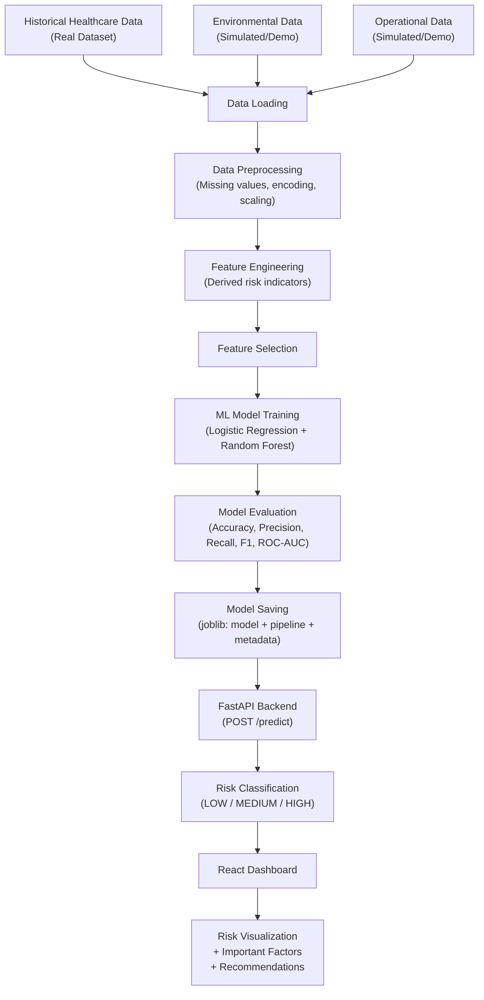

# Predictive Intelligence Framework for Early Hospital Infection Risk Assessment

## Project Overview

Build a **working Stage-I prototype** that estimates hospital infection risk using historical healthcare data combined with environmental and operational parameters. The system classifies infection risk into **LOW / MEDIUM / HIGH** and displays results through a React dashboard with a FastAPI backend.

> [!IMPORTANT]
> **This is a research/academic prototype, NOT a medical diagnostic system.** All predictions are for demonstration and decision-support purposes only.

---

## User Review Required

### Dataset Strategy — Critical Decision

After exhaustive research, **no single public dataset** exists that contains all three data categories (patient/healthcare + environmental + operational) with an infection target variable in one file.

**Recommended approach (Hybrid Real + Simulated):**

| Data Category | Source | Status |
|---|---|---|
| **Patient / Healthcare Data** | [Kaggle: Surgery Healthcare Dataset](https://www.kaggle.com/datasets/arunjangir245/surgery-healthcare-dataset) | ✅ Real public dataset — contains patient-level surgical/clinical data with infection-related outcomes |
| **Environmental Data** (temperature, humidity, CO2) | Simulated using realistic clinical ranges from published literature | ⚠️ DEMO DATA — clearly labeled throughout the system |
| **Operational Data** (ventilation, occupancy, cleaning interval) | Simulated using realistic hospital ranges | ⚠️ DEMO DATA — clearly labeled throughout the system |

> [!WARNING]
> **The environmental and operational features (temperature, humidity, CO2, ventilation, occupancy, cleaning interval) will be simulated.** They will be:
> - Generated with clinically plausible distributions (not random noise)
> - Explicitly labeled as `[SIMULATED/DEMO]` in the data dictionary, API docs, and UI
> - Never presented as real hospital sensor measurements
>
> This is an honest and transparent approach. The alternative — finding separate environment and patient datasets and doing a fake merge — would be scientifically dishonest.

### Alternative Option

If you **already have a specific dataset** or can obtain one (e.g., from a hospital partnership or your college), please share it and I will adapt the entire pipeline to that dataset instead.

---

## Open Questions

> [!IMPORTANT]
> 1. **Do you already have a dataset?** If so, provide it and I will skip the dataset preparation step entirely.
> 2. **Do you approve the hybrid (real patient data + simulated environmental/operational data) approach?** This is the most honest and practical path for a Stage-I prototype.
> 3. **Kaggle access:** Can you download the [Surgery Healthcare Dataset](https://www.kaggle.com/datasets/arunjangir245/surgery-healthcare-dataset) and place the CSV in the project directory? Or should I generate a fully synthetic dataset based on published clinical distributions?

---

## System Architecture



---

## Proposed Changes

### PHASE 1: Repository Setup & Dataset Preparation

#### [NEW] Project directory structure

```
hospital-infection-risk/
├── backend/
│   ├── app/
│   │   ├── __init__.py
│   │   ├── main.py              # FastAPI app + CORS + endpoints
│   │   ├── schemas.py           # Pydantic request/response models
│   │   ├── predictor.py         # Model loading + prediction logic
│   │   ├── preprocessing.py     # Input preprocessing for prediction
│   │   └── recommendations.py   # Rule-based recommendation engine
│   ├── models/                  # Saved model artifacts
│   │   ├── infection_model.joblib
│   │   ├── preprocessing_pipeline.joblib
│   │   └── feature_metadata.json
│   ├── data/
│   │   └── dataset.csv          # Combined dataset
│   ├── training/
│   │   ├── train_model.py       # Full training pipeline
│   │   └── data_analysis.py     # EDA + data report script
│   ├── requirements.txt
│   └── README.md
├── frontend/
│   ├── src/
│   │   ├── components/          # Reusable UI components
│   │   ├── pages/               # Dashboard page
│   │   ├── services/            # API service layer
│   │   ├── types/               # TypeScript interfaces
│   │   ├── App.tsx
│   │   └── main.tsx
│   ├── package.json
│   └── README.md
├── docs/
│   ├── architecture.md
│   ├── data_dictionary.md
│   └── implementation.md
└── README.md
```

---

### PHASE 2: Dataset Analysis & Data Report

#### [NEW] [data_analysis.py](file:///c:/Users/jyoth/OneDrive/Documents/Desktop/4-1%20project/major-project-stage-1/project%20implementation/hospital-infection-risk/backend/training/data_analysis.py)

- Load the dataset (real or generated)
- Display: row count, column count, column names, data types, missing values, duplicates, target distribution
- Identify target column
- Identify numerical vs. categorical features
- Generate summary statistics
- Output a data report to console and save as markdown

**Dataset features (planned):**

| Feature | Type | Category | Source |
|---|---|---|---|
| `patient_age` | Numerical | Healthcare | Real/Derived |
| `gender` | Categorical | Healthcare | Real/Derived |
| `length_of_stay` | Numerical | Healthcare | Real/Derived |
| `surgery_type` | Categorical | Healthcare | Real/Derived |
| `surgery_duration_hours` | Numerical | Healthcare | Real/Derived |
| `pre_op_risk_level` | Categorical | Healthcare | Real/Derived |
| `previous_infections` | Numerical | Healthcare | Real/Derived |
| `comorbidity_count` | Numerical | Healthcare | Real/Derived |
| `temperature` | Numerical | Environmental | SIMULATED |
| `humidity` | Numerical | Environmental | SIMULATED |
| `co2_level` | Numerical | Environmental | SIMULATED |
| `ventilation_status` | Categorical | Operational | SIMULATED |
| `room_occupancy` | Numerical | Operational | SIMULATED |
| `cleaning_interval_hours` | Numerical | Operational | SIMULATED |
| `infection_risk` | Binary (0/1) | Target | Derived |

> [!NOTE]
> The exact feature list will be finalized after inspecting the actual dataset. Features above marked "Real/Derived" will come from the source dataset. Features marked "SIMULATED" will be generated with clinically plausible ranges and clearly documented.

---

### PHASE 3: Data Preprocessing

#### [NEW] [preprocessing.py](file:///c:/Users/jyoth/OneDrive/Documents/Desktop/4-1%20project/major-project-stage-1/project%20implementation/hospital-infection-risk/backend/app/preprocessing.py)

**Pipeline steps:**
1. Handle missing numerical values → `SimpleImputer(strategy='median')`
2. Handle missing categorical values → `SimpleImputer(strategy='most_frequent')`
3. Encode categorical features → `OrdinalEncoder` or `OneHotEncoder`
4. Scale numerical features → `StandardScaler` (only where needed)
5. Save pipeline with `joblib` — fitted ONLY on training data

**Implementation:**
- Use `sklearn.pipeline.Pipeline` + `sklearn.compose.ColumnTransformer`
- Separate numerical and categorical column processing
- No data leakage: `fit()` only on `X_train`, `transform()` on both train and test

---

### PHASE 4: Feature Engineering

#### Engineered features (proposed, subject to dataset availability):

| Engineered Feature | Formula / Logic | Rationale |
|---|---|---|
| `stay_risk_score` | `length_of_stay / median_LOS` | Longer stays → higher infection exposure |
| `environmental_risk_index` | Weighted combination of temp, humidity, CO2 deviations from safe ranges | Composite environmental risk |
| `operational_risk_index` | Combination of ventilation quality, occupancy rate, cleaning delay | Composite operational risk |
| `overall_risk_composite` | `0.4 * env_risk + 0.4 * ops_risk + 0.2 * clinical_risk` | Combined multi-factor risk |

> [!NOTE]
> Every engineered feature will be documented with its formula and rationale. No meaningless mathematical combinations will be created.

---

### PHASE 5: Model Training & Evaluation

#### [NEW] [train_model.py](file:///c:/Users/jyoth/OneDrive/Documents/Desktop/4-1%20project/major-project-stage-1/project%20implementation/hospital-infection-risk/backend/training/train_model.py)

**Models to evaluate:**
1. **Logistic Regression** — interpretable baseline
2. **Random Forest** — ensemble, handles non-linearities
3. **Gradient Boosting (optional)** — if scikit-learn GradientBoostingClassifier is sufficient

**Training strategy:**
- 80/20 train-test split with stratification (`stratify=y`)
- Random seed: `42` (reproducible)
- 5-fold stratified cross-validation on training set
- Class imbalance handling: `class_weight='balanced'` parameter

**Evaluation metrics (for each model):**

| Metric | Purpose |
|---|---|
| Accuracy | Overall correctness |
| Precision | Of predicted infections, how many are correct |
| Recall | Of actual infections, how many are caught |
| F1-Score | Harmonic mean of precision/recall |
| ROC-AUC | Model's discrimination ability (AUC = Area Under the ROC Curve; ROC = Receiver Operating Characteristic) |
| Confusion Matrix | Visual breakdown of TP/TN/FP/FN |

**Model selection criteria:**
- Primary: F1-Score (balances precision and recall, important for potentially imbalanced data)
- Secondary: ROC-AUC
- Accuracy alone will NOT drive model selection if class imbalance exists

---

### PHASE 6: Model Saving

#### [NEW] models/ directory

Save artifacts:
```
models/
├── infection_model.joblib           # Trained model
├── preprocessing_pipeline.joblib    # Fitted preprocessing pipeline
└── feature_metadata.json            # Feature names, types, ranges, engineered features
```

The backend loads these at startup — **no retraining per request**.

---

### PHASE 7: Risk Classification

**Threshold-based classification using predicted probability:**

| Probability Range | Risk Level | Color Code |
|---|---|---|
| 0.00 – 0.33 | 🟢 LOW | Green |
| 0.34 – 0.66 | 🟡 MEDIUM | Amber |
| 0.67 – 1.00 | 🔴 HIGH | Red |

> [!WARNING]
> These thresholds are **prototype-defined** for demonstration purposes. They are NOT clinically validated. This will be clearly stated in the UI, API docs, and README.

After model training, I will evaluate whether these thresholds produce reasonable distributions. If the model's probability distribution is skewed, I will adjust and document the rationale.

---

### PHASE 8: FastAPI Backend

#### [NEW] [main.py](file:///c:/Users/jyoth/OneDrive/Documents/Desktop/4-1%20project/major-project-stage-1/project%20implementation/hospital-infection-risk/backend/app/main.py)

**Endpoints:**

| Method | Path | Description |
|---|---|---|
| `GET` | `/` | Health check |
| `GET` | `/model-info` | Model metadata, features, version |
| `POST` | `/predict` | Risk prediction |

**POST /predict — Request:**
```json
{
  "patient_age": 65,
  "gender": "M",
  "length_of_stay": 7,
  "surgery_type": "Cardiac",
  "surgery_duration_hours": 4.5,
  "pre_op_risk_level": "High",
  "previous_infections": 1,
  "comorbidity_count": 3,
  "temperature": 29.0,
  "humidity": 75.0,
  "co2_level": 1200,
  "ventilation_status": "Poor",
  "room_occupancy": 8,
  "cleaning_interval_hours": 18
}
```

**POST /predict — Response:**
```json
{
  "risk_level": "HIGH",
  "risk_probability": 0.78,
  "important_factors": [
    {"feature": "humidity", "importance": 0.23, "interpretation": "High humidity (75%) exceeds safe range"},
    {"feature": "co2_level", "importance": 0.18, "interpretation": "Elevated CO2 (1200 ppm)"},
    {"feature": "ventilation_status", "importance": 0.15, "interpretation": "Poor ventilation increases airborne risk"}
  ],
  "recommendations": [
    "Improve room ventilation to maintain adequate airflow",
    "Prioritize room cleaning — current interval exceeds 12 hours",
    "Review room occupancy levels"
  ],
  "disclaimer": "This is a prototype prediction for research purposes only. Not for clinical use."
}
```

#### [NEW] [schemas.py](file:///c:/Users/jyoth/OneDrive/Documents/Desktop/4-1%20project/major-project-stage-1/project%20implementation/hospital-infection-risk/backend/app/schemas.py)
- Pydantic models with field validators (ranges, types)
- Input validation: temperature (15–45°C), humidity (0–100%), CO2 (300–5000 ppm), occupancy (≥0), etc.

#### [NEW] [predictor.py](file:///c:/Users/jyoth/OneDrive/Documents/Desktop/4-1%20project/major-project-stage-1/project%20implementation/hospital-infection-risk/backend/app/predictor.py)
- Load model + pipeline + metadata at module level (singleton)
- Preprocess input → predict → classify → extract feature importance

#### [NEW] [recommendations.py](file:///c:/Users/jyoth/OneDrive/Documents/Desktop/4-1%20project/major-project-stage-1/project%20implementation/hospital-infection-risk/backend/app/recommendations.py)
- Transparent rule-based logic (not ML-generated)
- Recommendations based on input values vs. safe thresholds
- Example: humidity > 60% → "Reduce room humidity to below 60%"

---

### PHASE 9: React Frontend

#### Technology
- **React + Vite + TypeScript**
- **Vanilla CSS** — clean, professional, responsive
- No TailwindCSS, no component libraries

#### [NEW] Frontend structure
```
frontend/src/
├── components/
│   ├── Header.tsx               # App header with title
│   ├── InputForm.tsx            # Patient + Environmental + Operational inputs
│   ├── RiskResult.tsx           # Risk level display with color coding
│   ├── FactorsDisplay.tsx       # Important factors list
│   ├── Recommendations.tsx      # Preventive recommendations
│   ├── ErrorMessage.tsx         # Error display component
│   └── Disclaimer.tsx           # Research prototype disclaimer
├── pages/
│   └── Dashboard.tsx            # Main dashboard page
├── services/
│   └── api.ts                   # Axios/fetch API service
├── types/
│   └── index.ts                 # TypeScript interfaces
├── App.tsx
├── main.tsx
└── index.css                    # Global styles
```

#### UI Design
- **White background**, clean layout, clear typography (Inter/Roboto from Google Fonts)
- Professional hospital/medical aesthetic — not overly decorative
- **Responsive** — works on desktop and tablet
- Color-coded risk levels: 🟢 Green (LOW), 🟡 Amber (MEDIUM), 🔴 Red (HIGH)
- Clear section separation: Patient Info → Environmental → Operational → Predict → Results

#### Dashboard Sections
1. **Header:** "Hospital Infection Risk Assessment" + disclaimer banner
2. **Input Form** — three grouped sections:
   - Patient / Healthcare Information (age, gender, LOS, surgery type, etc.)
   - Environmental Parameters (temperature, humidity, CO2)
   - Operational Parameters (ventilation, occupancy, cleaning interval)
3. **"Predict Infection Risk"** button
4. **Result Panel:**
   - Risk Level badge (color-coded)
   - Risk Probability (percentage)
   - Important Model Features (ranked list)
   - Recommended Actions (bullet list)
5. **"New Assessment"** button to reset

---

### PHASE 10: Testing & Validation

#### Automated Tests

```bash
# Backend tests
cd backend
python -m pytest tests/ -v
```

**Test cases:**
- `test_preprocessing.py` — pipeline transforms data correctly
- `test_model_loading.py` — model loads from joblib
- `test_prediction_endpoint.py` — POST /predict returns valid response
- `test_invalid_input.py` — invalid values return 422 with helpful errors

#### Manual Test Scenarios

| Scenario | Inputs | Expected Behavior |
|---|---|---|
| Normal conditions | Temp=22, Humidity=45, CO2=400, Ventilation=Good, Occupancy=2, Cleaning=4h | Likely LOW risk |
| High env risk | Temp=32, Humidity=80, CO2=1500, Ventilation=Poor, Occupancy=8, Cleaning=24h | Likely HIGH risk |
| Mixed risk | Temp=25, Humidity=55, CO2=800, Ventilation=Moderate, Occupancy=5, Cleaning=10h | Likely MEDIUM risk |

> [!NOTE]
> These test cases are for **demonstration only**. Actual predictions depend on the trained model, not hard-coded expectations.

---

### PHASE 11: Documentation

#### [NEW] [README.md](file:///c:/Users/jyoth/OneDrive/Documents/Desktop/4-1%20project/major-project-stage-1/project%20implementation/hospital-infection-risk/README.md)
Complete project README with all 17 sections specified in the requirements.

#### [NEW] [docs/data_dictionary.md](file:///c:/Users/jyoth/OneDrive/Documents/Desktop/4-1%20project/major-project-stage-1/project%20implementation/hospital-infection-risk/docs/data_dictionary.md)
Feature table: Feature | Type | Range | Description | Source (Real/Simulated)

#### [NEW] [docs/architecture.md](file:///c:/Users/jyoth/OneDrive/Documents/Desktop/4-1%20project/major-project-stage-1/project%20implementation/hospital-infection-risk/docs/architecture.md)
- System Architecture diagram
- Use Case Diagram description
- Activity Diagram description
- Class Diagram description
- Sequence Diagram description
- All described in Mermaid notation + explanations

#### [NEW] [docs/implementation.md](file:///c:/Users/jyoth/OneDrive/Documents/Desktop/4-1%20project/major-project-stage-1/project%20implementation/hospital-infection-risk/docs/implementation.md)
Complete implementation flow documentation.

---

## Verification Plan

### Automated Tests
```bash
# Train the model
cd backend && python -m training.train_model

# Run backend tests
python -m pytest tests/ -v

# Start backend
python -m uvicorn app.main:app --reload --port 8000

# Start frontend (separate terminal)
cd frontend && npm install && npm run dev
```

### Manual Verification
1. Open the React dashboard in browser
2. Enter test data for each of the 3 test scenarios
3. Verify predictions come from the backend (not hard-coded)
4. Verify risk level matches probability thresholds
5. Verify important factors are model-derived
6. Verify recommendations are logical and input-based
7. Verify error handling for missing/invalid inputs
8. Verify the disclaimer is visible

### End-to-End Validation
```
User enters data in React form
  → Frontend validates input
  → POST /predict to FastAPI
  → Backend preprocesses with saved pipeline
  → Backend runs saved model
  → Backend classifies risk (LOW/MEDIUM/HIGH)
  → Backend extracts feature importance
  → Backend generates recommendations
  → Frontend displays result
```

---

## Development Sequence (Non-Negotiable Order)

| Phase | Task | Depends On |
|---|---|---|
| 1 | Repo setup + Dataset preparation | — |
| 2 | Dataset analysis + Data report | Phase 1 |
| 3 | Preprocessing pipeline | Phase 2 |
| 4 | Baseline model training | Phase 3 |
| 5 | Model evaluation + comparison | Phase 4 |
| 6 | Save best model | Phase 5 |
| 7 | FastAPI backend | Phase 6 |
| 8 | React frontend | Phase 7 |
| 9 | Connect frontend ↔ backend | Phase 7 + 8 |
| 10 | Testing + validation | Phase 9 |
| 11 | Documentation + diagrams | Phase 10 |

**After each phase:** run, test, fix errors, then proceed.

---

## Project Limitations (Documented Transparently)

- This is a **research prototype** for academic demonstration
- It is **not a medical diagnostic system**
- Model performance depends on dataset quality and size
- Environmental and operational features are **simulated** (clearly labeled)
- Risk thresholds (LOW/MEDIUM/HIGH) are **prototype-defined**, not clinically validated
- Predictions support decision-making — they do **not** replace healthcare professionals
- Feature importance shows **model importance**, not causal relationships

---

## Final Demonstration Commands

```bash
# Terminal 1: Backend
cd hospital-infection-risk/backend
pip install -r requirements.txt
python -m training.train_model       # Train and save model (one-time)
python -m uvicorn app.main:app --reload --port 8000

# Terminal 2: Frontend
cd hospital-infection-risk/frontend
npm install
npm run dev
```

Then open `http://localhost:5173` and demonstrate the full workflow:
Input → Predict → Result → New Assessment
